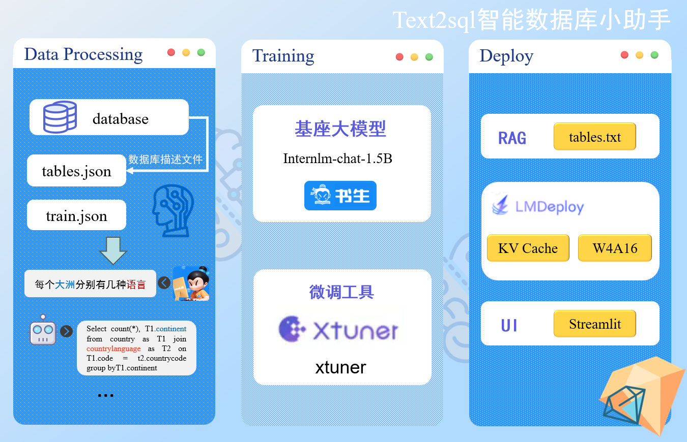

# text2mysql
基于InternLM进行微调的一个text2sql的数据库助手大模型
## 介绍
mysql是专门需要处理大量数据的非计算机技术领域人员训练的大模型，mysql小助手通过internlm的训练和微调，采用中英文的text2sql对话数据集，实现快速准确地获取数据库中的数据以支持决策。
基于InternLM地大模型学习项目，欢迎大家也来参加书生大模型实战项目（http://github.com/internLM/tutorial）
## 项目目标
* 精准、快速地将自然语言转换为sql语言
* 支持中文数据库查询
* 高效感知数据库项目名称、类别
* 接入agent实现自然语言输入->sql语言生成->sql执行->获得所需数据
## 产品功能
自然语言转换为sql语句
## 架构图

